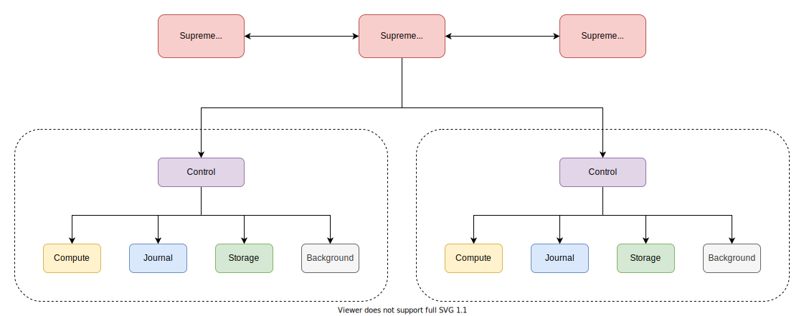
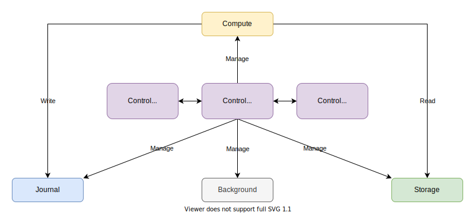
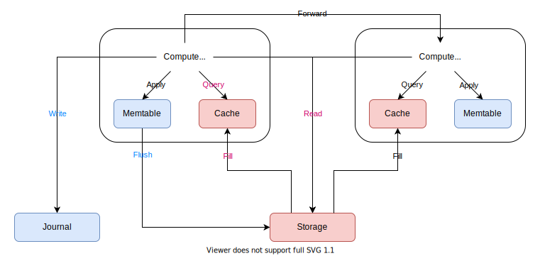

# Engula

This document describes the top-level design of Engula.

## Overview

Engula is a cloud-native storage engine for web-scale applications.
Engula aims to provide reliable and high-performance services with minimal cost on cloud platforms.
Cloud platforms provide elastic resources that can be provisioned on-demand, which opens a wide range of opportunities to re-architect the storage engine to exploit it.
To achieve this goal, Engula is designed from scratch to take full advantage of elastic resources on these platforms.

Engula unbundles components of a classic storage engine into single-function units.
For example, some units are responsible for data storage, some are responsible for command execution.
Each unit is a lightweight container that runs on a node and possesses a certain amount of resources on the node.
Nodes are provisioned from the running platform and constitute a unified resource pool to serve units.
That said, Engula can be regarded as a unit orchestration system that provides storage services as a whole.

The design principles of Engula are as follows:

- Make it simple and reliable first, then make it cost-effective and high-performance.
- Make it smart enough that requires minimal operation and configuration.
- Avoid external dependencies that are not built-in the platforms.

## Data Model

Despite being cloud-native, Engula is still a general-purpose storage engine.
Engula exposes a semi-structured data model with rich data types to support diverse applications.

An Engula deployment is called a universe.
A universe contains multiple databases, which in turn contain multiple collections.
A collection is a set of key-value pairs versioned with timestamps.

Keys are sequences of bytes, while values can be of various types.
Engula supports scalar types (numbers, strings), compound types (unions, structs), and collection types (maps, lists).
Consider that some real-world applications need to store lots of elements in a single value, Engula will support values of collection types that contain millions of elements.

Engula provides a far more rich set of APIs than existing storage engines.
Each data type provides a dedicated set of APIs to manipulate values of that type.
For example, numeric types support arithmetic operations like addition and subtraction, collection types support operations to insert, update, and delete individual elements.

Engula supports atomic updates to a single record and ACID transactions across multiple records within a database.
However, records of different databases are independent of each other, which means that interoperations between different databases are impossible.

## Architecture

Engula is cross-platform and vendor-independent.
Although the detailed design of Engula depends on a specific platform, this document describes the general cloud-native architecture.
In this document, we assume that the running platform supplies elastic resources and provides APIs to provision and de-provision nodes.

For more details about the design and implementation on a specific platform, see the following documents (TODO):

- Embedded Engine
- Amazon Web Services

Engula employs a [microunit](https://github.com/engula/microunit) architecture to exploit elastic resources.
To be specific, Engula decomposes its functionalities into different kinds of units:

- Supreme Unit
- Control Unit
- Compute Unit
- Journal Unit
- Storage Unit
- Background Unit

These units have varied resource requirements.
For example, some are CPU-bound while some are IO-bound, some require reliable resources, while some can run with cheap but unreliable resources.
The decomposition allows Engula to allocate optimal combinations of resources to different units according to their characteristics.
It also enables developers to extend Engula with custom units that leverage these built-in units to provide higher-level services.

### Universe

An Engula universe consists of a set of nodes provisioned from the running platform.

These nodes are homogeneous.
Each node can serve all kinds of units as long as it meets the unit's resource requirement.
In addition, nodes can be tagged with attributes, and units can be configured to only run on nodes with specific attributes.
Each node exposes APIs to provision and de-provision units on it.
It also maintains a list of provisioned units on the local file system.
On restart, the node resumes the execution of all units on the list and recovers their previous state if possible.

The relationships between different kinds of units are as follows:

The supreme unit is responsible for the top-level management of a universe.
It exposes APIs to create, delete, and configure databases.
It also monitors the load and health of the universe to scale nodes on demand.

The control unit is responsible for the top-level management of a database under the supreme unit.
It manages a dedicated set of units for the database.
Units of different databases are independent and do not interact with each other.
The details about these units are described later.

When a universe is bootstrapped, a group of supreme units is created.
These supreme units form a replication group that is capable of fail-over and self-repair.
Each supreme unit stores a replica of the universe metadata on the local file system.
A leader supreme unit is elected to process commands and maintain the metadata.
If the leader fails, followers will elect a new one.
If some follower fails, the leader will provision a new supreme unit to replace it.

### Database

The relationships between different kinds of units in a database are as follows:

When a database is created, the supreme unit registers the database and provisions a group of control units for it.
These control units form a replication group that is capable of fail-over and self-repair just like the supreme units.

The control unit serves as the housekeeper of a database.
It manages different kinds of units in different ways, but the common principles are as follows:

- Scale units that are overloaded or underloaded.
- Monitor the health of individual units and replace broken ones.

The control unit exposes APIs to create, delete, and configure collections.
Collections of the same database share the same set of units, including the compute, journal, storage, and background units.
From now on, with regard to a database, we use *the compute* to represent all compute units, *the journal* to represent all journal units, and *the storage* to represent all storage units.
The compute is responsible to process client commands, the journal is responsible to store logs, and the storage is responsible to store files.
The journal and the storage together constitute the persistent state of a database.

#### Shards

The compute and the journal can be divided into one or more shards.
Each shard manages one or more hash or range partitions of the database.

A group of compute units and journal units form a replication group.
Each replication group runs a consensus algorithm to serve one shard.
The compute units act as proposers to process commands for the shard.
A leader compute unit is elected as the distinguished proposer.
The journal units act as acceptors to replicate the logs and metadata for the shard.
Each journal unit stores a replica of the shard on the local file system.
More details about the consensus algorithm are described later.

The command execution flow of a shard is as follow:

The leader compute unit is responsible to process all write commands.
To process writes, the leader compute unit replicates the changes to the journal.
Then it applies the changes to the memtable and forwards them to followers for fast fail-over.
When the size of the memtable reaches a threshold, the memtable is flushed to the storage and a new memtable is created.

On the other hand, all compute units with the required data can process read commands.
To process reads, the compute unit merges changes in the memtable with data in the local cache or the remote storage to construct the required data.
The compute unit queries the local cache first.
On cache misses, it reads from the remote storage instead and then fills its local cache.
Followers can also serve reads to offload read traffics from the leader.
However, when a follower processes reads, it may not have the up-to-date data to serve.
In this case, the follower can wait for the latest changes from the leader or just redirect the command to the leader instead.

Partitions can be split, merged, and moved between shards for load balance.
To split or merge partitions in the same shard, the compute unit just issues a configuration change to update the metadata of the shard.
However, it requires two phases to move partitions between different shards.

**To transfer a partition from the source shard to the target shard:**

- Phase 1: pre-move
  - The source issues a command that updates its metadata to indicate the movement.
  - Then the source issues a command to the target to register the movement.
  - On failure, the source just aborts the movement.
  - On success, the source starts flushing its memtable to the storage.
  - Meanwhile, the source forwards all writes to the target first and applies the writes to its memtable if they have succeeded in the target However, all reads are still processed by the source because only the source possesses the complete data of the moving partition during the flush.
  - On the other hand, the target processes writes from the source in the same way as it processes writes from other clients.
- Phase 2: post-move
  - When the source finishes flushing the previous memtable, it notifies the target to commit the movement.
  - On failure, the source just retries until success.
  - Then the source issues a configuration change to update its metadata and stops processing commands of the moved partition.

#### Storage

First of all, there are no shards in the storage.
That is, all shards share the same set of storage units.
The observation is that, in most cases, the size of the storage dominates the database, while the compute and the journal only contain a small working set.
By separating shards from the storage, the benefits are multi-fold:

- It reduces the number of shards and the overhead to manage them.
- It reduces the cost to alter shards since most data stays in the storage.
- It reduces the chance to alter shards since the working set grows slowly, which makes the system more stable.
- It simplifies the design of the storage, which just stores immutable files that do not subject to external activities.

The storage architecture is as follow:

The storage consists of a manifest and a set of data files organized into collections.
The manifest records the metadata of each file as well as the file layout of each collection.
Collections can use different file structures to optimize for specific workloads.

A manifest is composed of a manifest file and a manifest journal.
The manifest file records the base version of the manifest, which describes the file layout in the storage.
The manifest journal records a sequence of version edits applied on the base version.
When the size of the manifest journal reaches a threshold, the manifest journal is merged with the manifest file to form a new base version.

The manifest file and all data files are immutable and replicated in storage units, while the manifest journal is replicated in control units for incremental updates.
The control unit is responsible to maintain the manifest and distribute files among storage units.

A storage unit stores immutable files on the local file system.
The storage unit is designed to be as reliable and cost-effective as possible.
It relies on the performance of the local file system without further optimizations.
We leave performance optimization to the upper level, which has more application context to make better trade-offs.
For instance, a dedicated cache tier can be introduced on top of the compute to boost read performance on demand.

The storage unit also records access statistics for each file and reports them to the control unit.
The control unit calculates the hotness of individual files from these statistics to balance file distribution.
For example, the control unit can add more replicas for hot files in the fast storage tier to share traffics, while keeping cool files in the slow storage tier to save cost.

In addition, the control unit can schedule background jobs to reorganize files in storage units.
For example, the control unit can schedule compactions to merge files with overlapped ranges to improve read performance.
The control unit can also schedule compressions or garbage collections to reduce storage usage.
When a background job is scheduled, the control unit provisions a background unit to run it.
Since the background job is fault-tolerant and will not affect foreground services even if it fails, the background unit can be served with cheap but unreliable resources to save cost.

## Consensus Algorithm (TODO)

Engula develops a variant of the Raft consensus algorithm to serve its architecture.
The original Raft algorithm bundles the compute and storage of logs together, which is the opposite of Engula's design.

## Distributed Transaction (TODO)

Engula supports distributed transactions with snapshot isolation.
More strict isolation levels are possible, but snapshot isolation should be good enough for most web-scale applications.

Engula implements a two-phase commit protocol and orders transactions with hybrid logical clocks.
